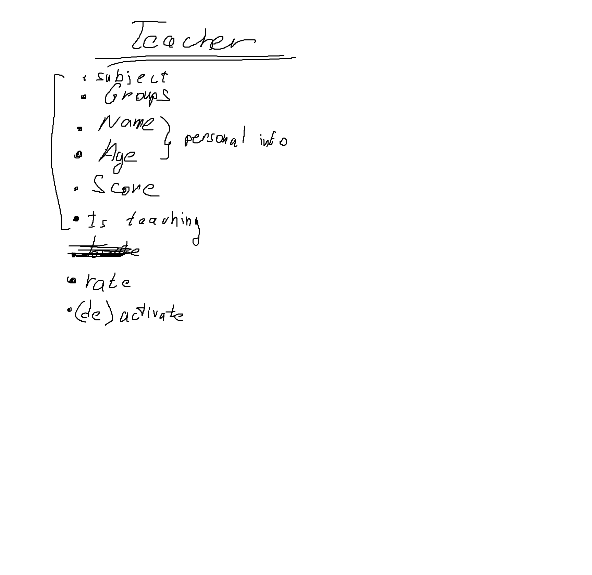
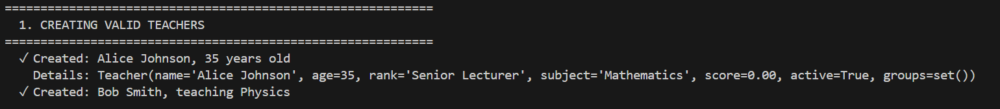
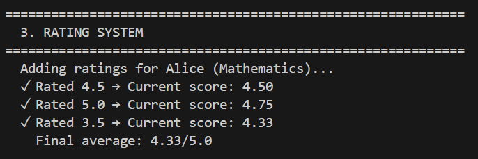
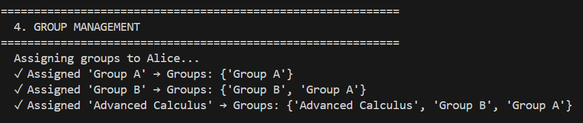
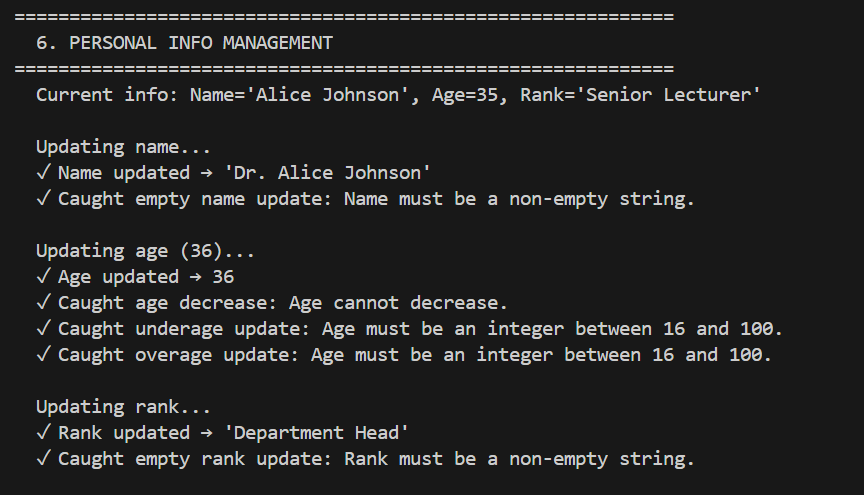
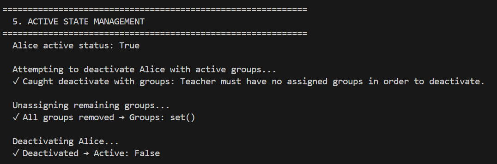
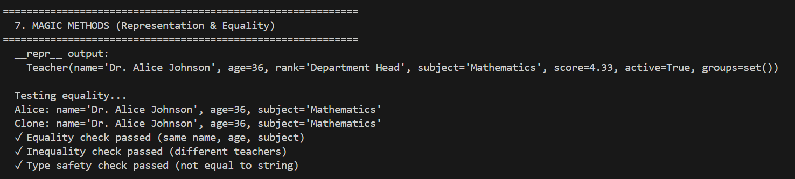

# Проектирование класса
Это мой план по созданию класса Teacher. Скобочкой выделены атрибуты, остальное методы

Потом я начал продумывать инварианты, в ходе чего я понял что сабжект обязан быть строкой, группы обязаны быть множеством, имя + возраст + ранг (я решил его тоже учитывать) будут одним списком параметров, так же скор будет даблом от 0 до 5, ну а состояние активности будет булевой переменной.
После этого я занялся проработкой всех методов и интерфейсов, т.к. управление учителем должно (на мой взгляд) быть понятно любому кентику, я решил всецело реализовать его через интерфейсы, не давая возможности юзеру испоганить все на свете. Вооооооооот.....
После составления списка существующих штуковин в области, определения характеристик/действий объекта в области (опять же), просчета инвариантов я приступил к анализу объектов.
На мой взгляд объекты считаются одинаковыми, когда у них одинаковое имя, возраст и преподаваемый предмет, это я и реализовал в мэджик методе __eq__. Состояния объекта всего 2: преподаватель либо актив, либо инактив, из чего можно сделать вывод, что все методы, меняющие что либо могут работать ТОЛЬКО когда объект активен.
# Шоукейс всего что класс умеет
Создаем учителей

Система оценивания

Система управления группами

Система управления персональными данными

Система управления состоянием

Магические методы
